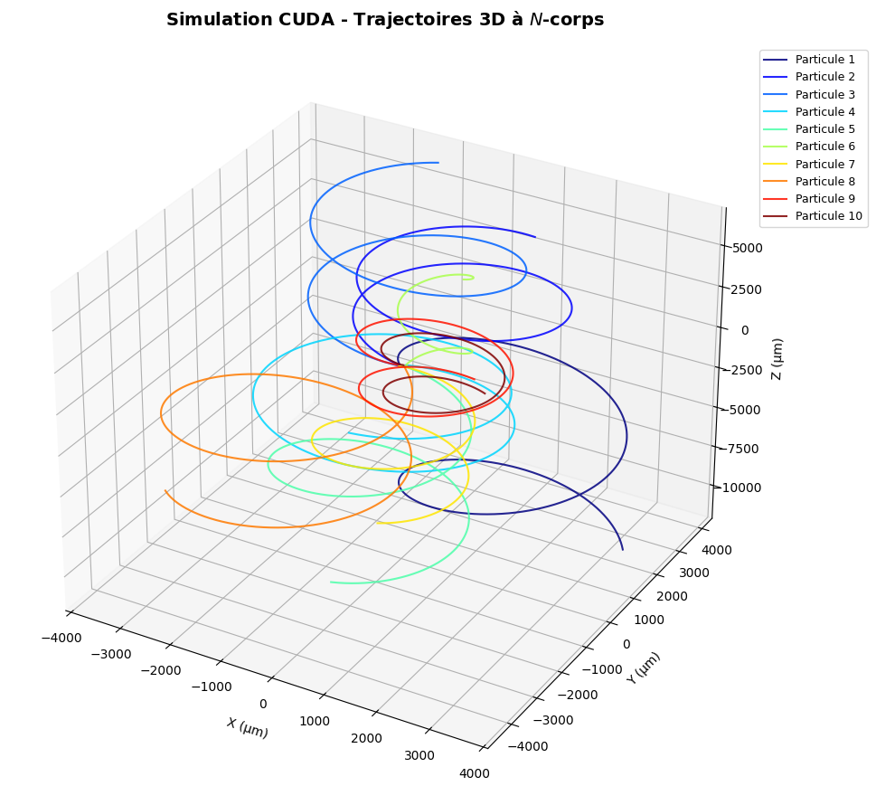

# Simulateur de Particules Chargées N-Corps en CUDA


## I Présentation Générale

### I.1 Objectifs & Motivation

Ce projet s'inscrit dans une démarche d'**apprentissage pratique de la programmation accélérée GPU avec CUDA**, intégrée au sein d'une architecture native en **C/C++**.

L'objectif est d'aborder les concepts fondamentaux du calcul haute performance (HPC) : gestion de la mémoire hôte/périphérique, répartition des blocs de threads, synchronisation et optimisation des accès à la mémoire partagée (*Shared Memory*) sur des cas d'usage de simulation numérique.

### I.2 Modélisation Physique et Numérique

Le programme a pour but de simuler un **flux de particules chargées** soumises à un champ d'équations physiques complexes (forces électromagnétiques extérieures et répulsion inter-particulaire).

*   **Dynamique continue :** La trajectoire de chaque particule est gouvernée par un système d'équations différentielles ordinaires (EDO) décrivant son accélération en fonction des forces appliquées.
*   **Intégration numérique par Runge-Kutta 4 ($RK4$) :** Pour résoudre ces équations, le kernel calcule à chaque pas de temps $dt$ l'état futur des particules. L'algorithme $RK4$ évalue quatre pentes successives pour intégrer avec une haute précision :
*   Le vecteur **position**
  
  $$\vec{r}(t + dt)$$
  
*   Le vecteur **vitesse**
  
$$\vec{v}(t + dt)$$

### I.3. Workflow & Environnement de Prototypage

L'ensemble du projet est développé, compilé et exécuté au sein de l'environnement Cloud **Google Colab** :

*   **Accélération Matérielle :** Exploitation d'un GPU **NVIDIA T4** pour paralléliser massivement le calcul des intéractions $N$-corps.
*   **Chaîne d'Exécution :** Édition du code C++/CUDA natif, compilation ciblée via `nvcc`, puis export des données de trajectoires vers des modules de visualisation Python (Matplotlib / NumPy) intégrés au Notebook.

<br>

## II Environnement de Développement

### II.1 Synthèse

Le code est développé sur Google Colab. Détourné de son usage Python classique, Google Colab constitue un banc d'essai extrêmement efficace pour le développement C++/CUDA. Il permet de valider la logique d'un kernel, de benchmarker des optimisations de mémoire partagée et de produire un code prêt à être déployé sur un environnement HPC, le tout sans aucune contrainte d'installation logicielle ou de matériel local.

### II.2 Configuration Hardware et Logicielle

*   **Processeur Graphique (GPU) :** NVIDIA T4.
*   **Plateforme d'Exécution :** Google Colab (Linux / Cloud).
*   **Système d'Exploitation :** Environnement conteneurisé basé sur Ubuntu.
*   **Stack Logiciel :** Drivers NVIDIA officiels et SDK CUDA préinstallés (CUDA 12+).

### II.3 Toolchain de Compilation et Workflow

*   **Édition du Code Source :**
Utilisation de la commande magique `%%writefile main.cu` pour rédiger le code C++/CUDA directement dans les cellules du Notebook.
*   **Compilateur (`nvcc`) :**
Compilation native via le compilateur NVIDIA CUDA Compiler (`nvcc`) en ciblant l'architecture exacte du GPU T4 :
```bash
    !nvcc --use_fast_math -O3 main.cu -o main_cuda
```

*   `-O3` : Optimisation maximale du code binaire.

*   **Pipeline de Restitution :**
Le binaire exécutable exporte les résultats de calcul (trajectoires, données de simulation) vers un fichier local (`.csv` ou binaire), immédiatement exploitable dans les cellules suivantes par les bibliothèques Python (`Matplotlib`, `NumPy`) pour la visualisation.

<br>

## III Modélisation Physique

Ce projet simule la dynamique temporelle d'un système à $N$-corps de particules chargées (de charge $q$ et de masse $m$) évoluant dans un espace tridimensionnel sous l'action combinée de champs électromagnétiques extérieurs et de leurs intéractions électrostatiques mutuelles.

### III.1 Force de Lorentz (Champs extérieurs)

Chaque particule évoluant à la vitesse $\vec{v}$ subit l'action d'un champ électrique $\vec{E}$ et d'un champ magnétique $\vec{B}$ extérieurs. L'accélération associée s'exprime selon la loi de Lorentz :

$$\vec{a}_{\text{Lorentz}} = \frac{q}{m} \left( \vec{E} + \vec{v} \times \vec{B} \right)$$

Dans la configuration actuelle du code ($\vec{E} = \vec{0}$ et $\vec{B} = (0, 0, B_z)$), ce terme impose une trajectoire gyromagnétique (mouvement circulaire ou hélicoïdal autour des lignes de champ magnétique).

### III.2 Interaction Coulombienne N-Corps (Effet de charge d'espace)

En plus des champs extérieurs, les particules exercent une répulsion électrostatique directe les unes sur les autres. L'accélération subie par la particule $i$ due à l'ensemble des autres particules $j$ s'écrit :

$$\vec{a}_{\text{Coulomb}, i} = \frac{q^2}{4\pi\varepsilon_0 m} \sum_{j \neq i} \frac{\vec{r}_i - \vec{r}_j}{\left( \|\vec{r}_i - \vec{r}_j\|^2 + \varepsilon^2 \right)^{3/2}}$$

Un paramètre d'adoucissement $\varepsilon$ (*softening factor*) est intégré au dénominateur pour éviter la divergence numérique de la force lors de croisements à très courte distance.

## IV Vue d'Ensemble de l'Architecture

Le code est exécuté sur un couple **Host (CPU) / Device (GPU)**:

**Host (CPU - main)** :
- Gère l'allocation mémoire CPU et GPU
- Initialisation particules (positions/vitesses)
- Contrôle de la boucle principale de calcul
- Exportation des trajectoires au format CSV

**Device (GPU Kernels & Functions)** :
- Calcul parallèle de l'accélération $N$-corps
- Intégration numérique avec un algorithme **Runge-Kutta d'ordre 4 (RK4)** sur GPU.

```
[ Host (CPU) ]
   - Allocation dynamique (Structure of Arrays SoA)
   - Initialisation distribuée
   - Transfert Host-to-Device (cudaMemcpy)
          │
          ▼
   [ Device Loop (GPU) - 10 000 étapes ]
   ┌────────────────────────────────────────────────────────┐
   │ update_particles <<<blocks, threads>>>                 │
   │   │                                                    │
   │   ├──> Chargement de l'état local dans les registres   │
   │   ├──> step_rk4()                                      │
   │   │     └──> compute_dydt()                            │
   │   │           ├── Force de Lorentz (Champ B externe)   │
   │   │           └── Force de Coulomb (Shared Memory)     │
   │   └──> Mise à jour VRAM & enregistrement trajectoires  │
   └────────────────────────────────────────────────────────┘
          │
          ▼
[ Post-Processing (CPU) ]
   - Transfert Device-to-Host des trajectoires
   - Écriture du fichier CSV (particle_trajectory.csv)
   - Libération mémoire
```

## IV.1 Structure des Données & Alignement Mémoire

### Layout SoA
Le code utilise un schéma **SoA** (*Structure of Arrays*) via la structure Particles :

```cpp
struct Particles {
  float* position_x;
  float* position_y;
  float* position_z;
  float* velocity_x;
  float* velocity_y;
  float* velocity_z;
  // Pointeur pour le stockage des 10 trajectoires témoins
  float* d_pos_x;
  float* d_pos_y;
  float* d_pos_z;
};
```

**Avantages d'architecture :**
*   **Coalescence des accès mémoire** : Les threads contigus d'un même warp (32 threads) accèdent à des adresses mémoire adjacentes en VRAM (position_x[idx])
*   **Passage par valeur** : La structure Particles (contenant 9 pointeurs GPU) est transmise par valeur au kernel update_particles.

<br>

## IV.2 Stratégie de Parallélisation & Optimisations CUDA

### Tiling par Mémoire Partagée (__shared__)
Le calcul des intéractions électrostatiques directes entre toutes les paires de particules possède une complexité de $\mathcal{O}(N^2)$.
Pour éviter d'effectuer $N^2$ accès à la mémoire globale GPU (haute latence), le kernel découpe l'ensemble des particules en **tuiles (tiles)** de taille `BLOCK_SIZE` (256) chargées en **Mémoire Partagée (Shared Memory)** :

1.  Chaque thread du bloc charge une particule depuis la VRAM vers les tableaux partagés
2.  Une barrière de synchronisation `__syncthreads()` garantit la disponibilité des données pour tout le bloc.
3.  Chaque thread calcule la force exercée sur sa particule par les 256 particules de la tuile courante.
4.  Une seconde barrière `__syncthreads()` sécurise la mémoire avant de charger la tuile suivante.

<br>

### IV.3 Schéma d'Intégration RK4 (`step_rk4`)

L'état 6D de la particule 

$$\vec{S} = (x, y, z, v_x, v_y, v_z)^T$$

est mis à jour à chaque pas de temps $\Delta t = 10^{-9}\,\text{s}$ via les 4 coefficients classiques de Runge-Kutta :

$$k_1 = f(t, \vec{S})$$

$$k_2 = f\left(t + \frac{\Delta t}{2}, \vec{S} + \frac{\Delta t}{2} k_1\right)$$

$$k_3 = f\left(t + \frac{\Delta t}{2}, \vec{S} + \frac{\Delta t}{2} k_2\right)$$

$$k_4 = f(t + \Delta t, \vec{S} + \Delta t \, k_3)$$

$$\vec{S}_{n+1} = \vec{S}_n + \frac{\Delta t}{6} \left( k_1 + 2k_2 + 2k_3 + k_4 \right)$$

## IV.4 Flux d'Exécution & Gestion de la Mémoire

1.  **Allocation Heap CPU** : Utilisation de pointeurs dynamiques (`new float[...]`) pour $N = 2000$ particules afin d'éviter tout risque de Stack Overflow.
2.  **Distribution Initiale** : Positions distribuées aléatoirement dans $[-10^{-4}, 10^{-4}]\,\text{m}$ et vitesses dans $[-10^3, 10^3]\,\text{m/s}$.
3.  **Boucle d'Intégration** : Lancement du kernel pour 10 000 étapes temporelles avec vérification de statut CUDA (`cudaGetLastError`).
4.  **Enregistrement Continu** : Sauvegarde GPU en temps réel de la trajectoire de 10 particules témoins via un indexage linéaire 1D : `idx * nb_step + step`.
5.  **Nettoyage** : Restitution complète des ressources VRAM (`cudaFree`) et mémoire hôte (`delete[]`).


## IV.5 Résultat obtenu et discussion

La simulation a été menée avec 2000 particules. Elle prend environ 1 minute à exécuter dans l'environnement décrit.
On obtient les 10 premières trajectoires suivantes.



Les trajectoires des particules forment des hélices et celles-ci sont déformées par les intéractions entre particules

Pour cela, il a fallu paramétrer précisément les positions et vitesses initiales des particules et régler le pas dt. L'équilibre de cette simulation repose sur le mouvement d'une particule chargée dans un champ magnétique $B$, régi par la **pulsation cyclotron** ($\omega_c$) et le **rayon de Larmor** ($r_L$).

<br>

#### La Pulsation Cyclotron ($\omega_c$) et la Période Cyclotron ($T_c$)

Lorsqu'une particule de charge $q$ et de masse $m$ évolue dans un champ magnétique uniforme $B$, la force de Lorentz la force à tourner autour des lignes de champ à une fréquence angulaire propre :

$$\omega_c = \frac{\vert{}q\vert{} B}{m}$$

La période $T_c$ nécessaire pour accomplir **un tour complet** (une spire) est :

$$T_c = \frac{2\pi}{\omega_c} = \frac{2\pi m}{\vert{}q\vert{} B}$$

#### Le Rayon de Larmor ($r_L$)

C'est le rayon de la trajectoire circulaire (ou hélicoïdale) décrite par la particule autour du champ $B$, en fonction de sa vitesse perpendiculaire $v_\perp$ :

$$r_L = \frac{v_\perp}{\omega_c} = \frac{m v_\perp}{\vert{}q\vert{} B}$$

Application Numérique avec les constantes du code
* Charge du proton $q = 1.6 \times 10^{-19} \text{ C}$
* Masse du proton $m = 1.67 \times 10^{-27} \text{ kg}$
* Champ magnétique $B_z = 10^{-2} \text{ T}$ (0.01 Tesla)
* Vitesse typique $v_\perp \approx 10^3 \text{ m/s}$ (1 000 m/s)

#### Calculs :

1. **Pulsation cyclotron $\omega_c$ :**

$$\omega_c = \frac{1.6 \times 10^{-19} \times 10^{-2}}{1.67 \times 10^{-27}} \approx \mathbf{9.58 \times 10^5 \text{ rad/s}}$$


2. **Période d'une rotation $T_c$ :**

$$T_c = \frac{2\pi}{9.58 \times 10^5} \approx \mathbf{6.56 \times 10^{-6} \text{ s}} \quad (6.56 \ \mu\text{s})$$


3. **Rayon de Larmor $r_L$ :**

$$r_L = \frac{1000}{9.58 \times 10^5} \approx \mathbf{1.04 \times 10^{-3} \text{ m}} \quad (\approx 1 \text{ mm})$$

#### - Le pas de temps ($dt = 10^{-9} \text{ s}$)

* Pour que le schéma RK4 intègre proprement une rotation circulaire sans dérive numérique, il faut au moins plusieurs centaines ou milliers de points par période $T_c$.
* Avec $dt = 10^{-9} \text{ s}$, une boucle complète $T_c = 6.56 \ \mu\text{s}$ se compose de **6 560 pas d'intégration**.

#### - Le nombre d'étapes ($N_{\text{steps}} = 10\ 000$)

* Durée totale de la simulation : $T_{\text{total}} = 10\ 000 \times 10^{-9} \text{ s} = 10 \ \mu\text{s}$.
* Nombre de tours effectués : $\frac{T_{\text{total}}}{T_c} = \frac{10 \ \mu\text{s}}{6.56 \ \mu\text{s}} \approx \mathbf{1.52 \text{ tours}}$.
* **Rendu graphique :** La simulation s'arrête après environ **1,5 spire**

#### - La taille de la boîte initiale ($\pm 10^{-4} \text{ m} = \pm 0.1 \text{ mm}$)

* Le rayon de Larmor vaut $r_L \approx 1 \text{ mm}$.
* En plaçant les particules initialement dans une boîte de $0.2 \text{ mm}$ de côté, elles commencent **très proches les unes des autres** par rapport à leur rayon d'hélice ($0.1 \times r_L$).
* Cela garantit que les forces Coulombiennes ($F \propto 1/r^2$) s'exercent fortement au début de la trajectoire, déformant l'hélice de manière visible avant que les particules ne s'écartent sous l'effet du champ $B$.
